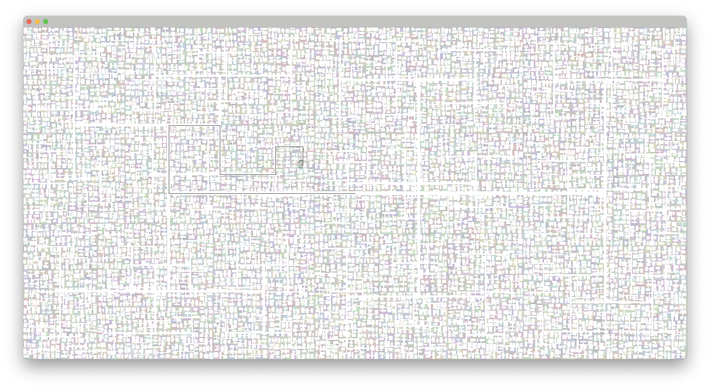

# BSP Chunk Gen

Test of binary space partitioning for chunk generation, with loading/unloading system inspired by minecraft

## Media

This media is not actually from the demo above. Rather from earlier versions.

The actual demo has distinct chunks that are generated using BSP when the player loads them within range.

